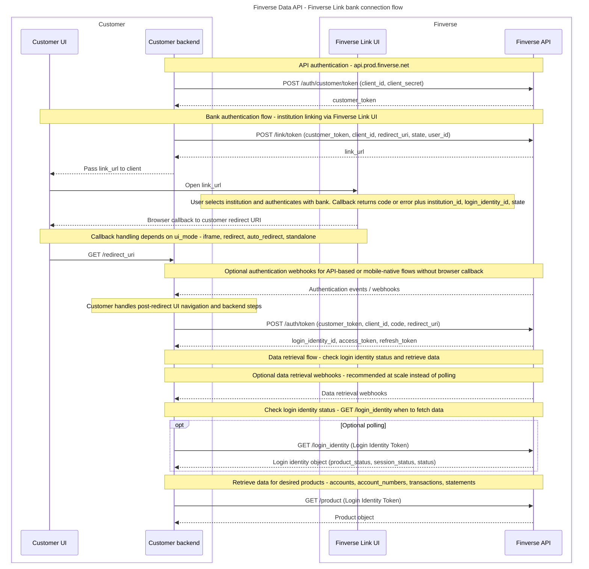

After Finverse API authentication, follow these steps to link and retrieve data from your first Institution (e.g. Testbank).

## **Sequence diagrams: Data API**

## **A. Institution linking**

- Generate a `link_token` using the `customer_token` (POST /link/token). The `link_token` is a short lived, limited-scope token used to initialize Finverse Link (i.e. each time you want an end-user to link a financial institution).
- Use the Link URL included in the `link_token` response to launch the Finverse Link UI, which will guide the end-user through selecting an institution and authenticating with it.
- After the end-user has successfully authenticated with the institution using the Link UI, Finverse will call the `redirect_uri` with a one-time use `code` (e.g. [https://example.com/callback?code=linkAuthCode&state=stateparameter](https://example.com/callback?code=linkAuthCode&state=stateparameter)). Note: if you are manually launching the Link UI in a browser, you will see the code in the URL parameters on the Link UI success screen.
- If there was error when linking to institution, Finverse will call the `redirect_uri` (e.g. [https://example.com/callback?error=credentials\_invalid&error\_description=The\+credentials\+you\+entered\+were\+incorrect&error\_details=Your\+account\+may\+get\+locked\+out\+after\+several\+unsuccessful\+attempts&state=stateparameter](https://example.com/callback?error=credentials_invalid&error_description=The+credentials+you+entered+were+incorrect&error_details=Your+account+may+get+locked+out+after+several+unsuccessful+attempts&state=stateparameter)). This error callback will contain the following URL parameters:\
  \* error: Error code\
  \* error\_description: Summary description of the error\
  \* error\_details: Additional details on the error.
- Exchange the `code` for a `login_identity_token` (POST /auth/token). You should securely store each `login_identity_token` in your back-end as you will need it to request data.

Note: the `login_identity_token` is unique for each financial institution linked by the end-user, e.g. an end-user with 2 linked institutions will have a distinct token for each institution.

## **B. Data retrieval**

Request the end-user's data using the end-user's `login_identity_token`:

- `GET /[PRODUCT]`

Products: `accounts`, `account_numbers`, `balance_history`, `identity`, `statements`, `transactions`.

## **C. Linking more institutions**

To link another financial institution for the end-user, repeat from step B(1) onwards (generate `link_token`). You will end-up with another `login_identity_token` for the same end-user, representing the additional financial institution.

# **Additional guidance**

## **Embedding our Link UI in your webapp**

If you are embedding the Finverse Link UI in a webapp, make sure your webapp is accessed via `https` or `localhost`. We encrypt end-user credentials client-side before sending them to Finverse servers, using the `webcrypto` API, which supports only **secure context**.