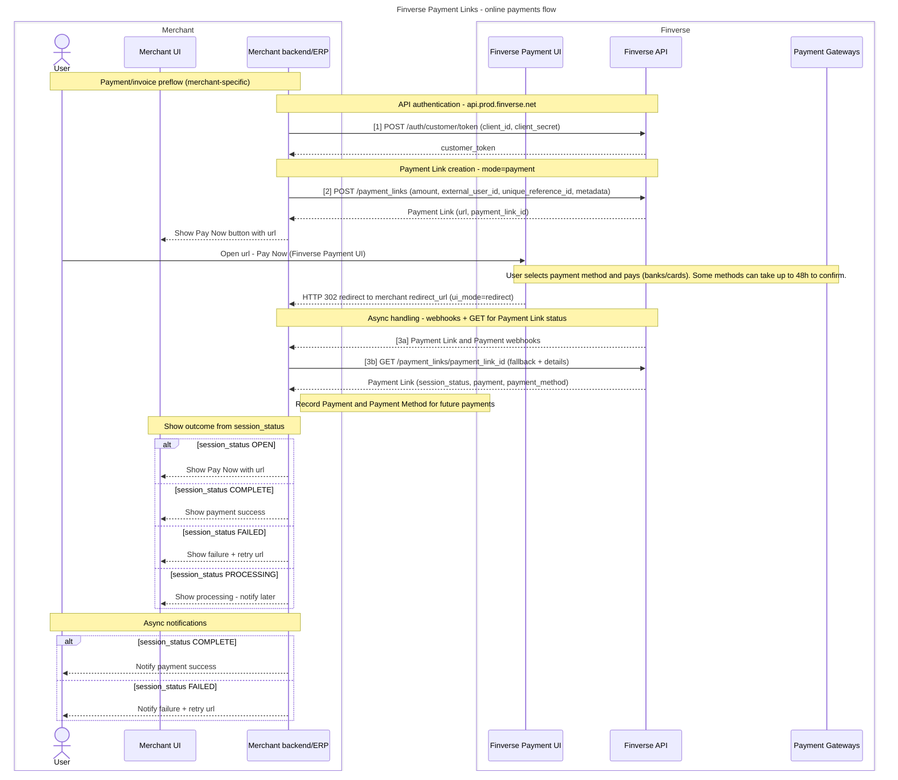
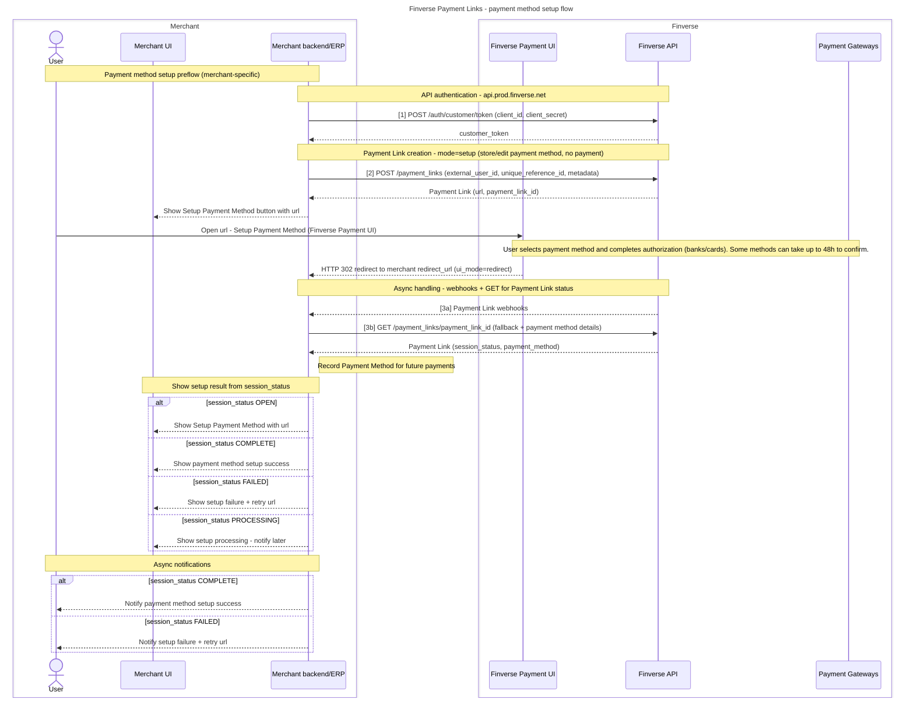
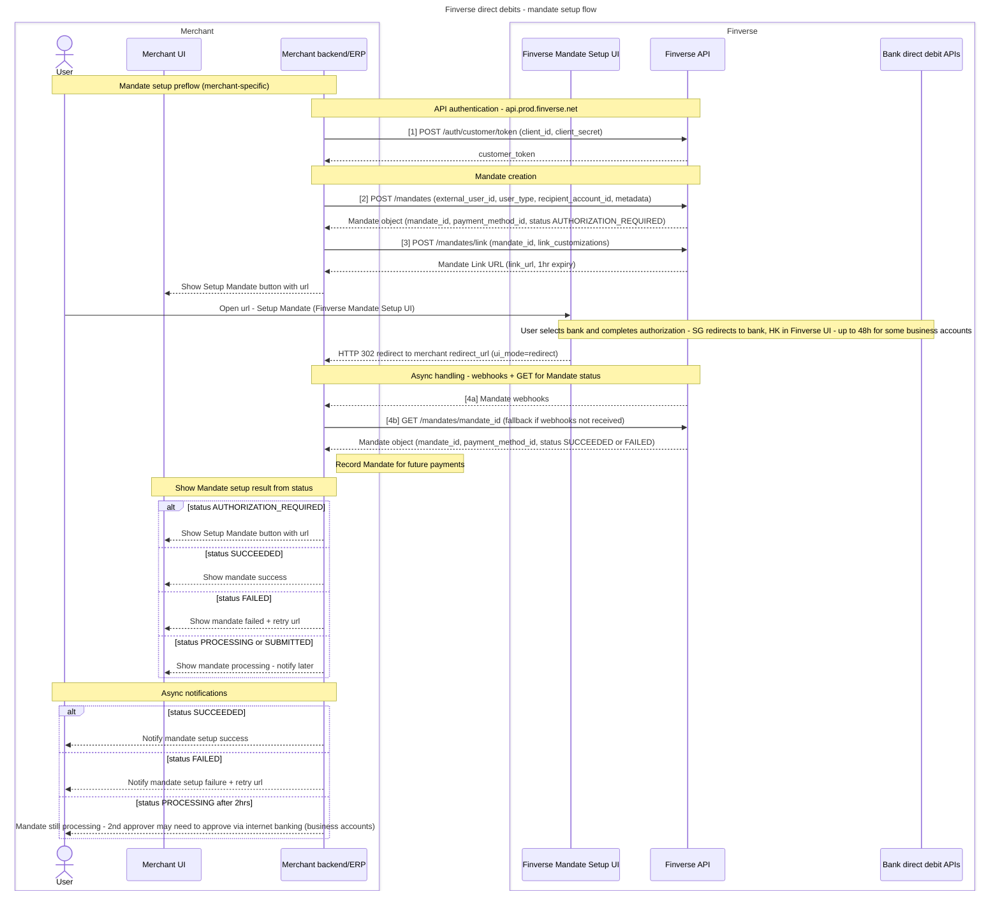
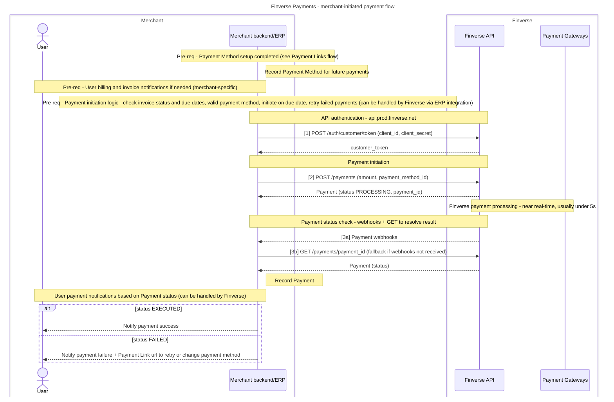

Finverse's Payments API allow you to:

- **Collections: Set up single and recurring payments (collections)**, as well as direct debit mandates, from end-users' accounts at supported institutions
- **Payouts: Setup payouts from Finverse** to end-users' accounts at supported institutions.

### **Collections**

Finverse supports two collections flows:

- **A. Payment Links (recommended integration)**: our easy-to-use payment links allow end-users to select a payment method and confirm a payment directly in Finverse's UI. Finverse will also provide email notifications to end-users throughout the payment journey (e.g. when a Mandate is successfully setup, or a FPS payment is received). Payment Links support multiple payment methods:
  - Direct debit mandates (enabled by default)
  - FPS QR code (enabled by default)
  - Credit cards (disabled by default -- contact Finverse to enable).
- **B. Mandate-based Payments**: payments are executed based on a pre-authorized Mandate (e.g. Direct Debit mandate). This allows customers to separate the Mandate setup and Payment steps (e.g. to setup a Mandate upfront and collect a Payment 1 month later).

### **Payouts**

Finverse currently supports scheduled payouts, funded by either:

- Direct debit mandates you have setup
- Your current funds balance

Please contact Finverse to enable access to Payouts and related endpoints (Payment Users, Payment Accounts).

# **Get Started**

After Finverse API authentication, follow these steps to collect a Payment from your first Institution (e.g. Testbank).

#### **A. Payment Links**

- Create a Payment Link URL via `POST /payment_links`
- Invite the end-user to setup their Payment in the Finverse UI (using the Payment Link URL generated). The end-user will be asked to select their payment method, provide their payment details, and confirm the payment.
- Check the Payment Link until the Payment Link status is `PAID` (via webhooks or `GET /payment_links/{payment_link_id}`)

#### **B. Mandate-based Payment**

- Create a Mandate via `POST /mandates`
- Generate a Mandate `link_url` using the `mandate_id` via `POST /mandates/link`
- Invite the end-user to authorize the Mandate in the Finverse UI (using the Mandate `link_url` generated). The end-user will be asked to confirm their account details.
- Check the Mandate until the Mandate status is `SUCCEEDED` (via webhooks or `GET /mandates/{mandate_id}`)
- Create a Payment via `POST /payments`
- Check the Payment until the Payment status is `EXECUTED` (via webhooks or `GET /payments/{payment_id}`)

Amount to be paid in currency's smallest unit. For example, HKD 100.01 is represented as amount = 10001. For currencies without minor units (e.g. VND, JPY), the amount is represented as is, without modification. For example, VND 15101 is represented as amount = 15101.

## **Sequence diagrams: Payments API**

#### **Payment Links: Payment mode**

This flow is used to collect a one-time Payment from a user using an online link, with additional options to store the user's Payment Method and setup future autopayments.

#### **Payment Links: Setup mode**

This flow is used to create an online link for a user to setup & store a Payment Method for future payments (using the Payment collection flow below).

#### **Direct debit mandate setup flow (eGIRO/eDDA setup)**

This flow is used to allow users to setup a direct debit authorization mandate (i.e. eGIRO/eDDA setup), which can then be used to collect future payments (using the Payment collection flow below).

#### **Payment collection flow (using a stored Payment Method)**

This flow is used by merchants to initiate a Payment collection using a user's stored Payment Method (any stored payment method including card or direct debit mandate).

# **Implementation notes**

#### **Currency amounts: "Minor" units**

**All amounts in the Payments API are expressed as integers in ISO 4217 "minor" currency units.**

A "minor" currency unit represents an amount in a currency's smallest unit (usually, but not always, "cents"). For example, HKD 100.01 is represented as amount = 10001.

For currencies without minor units (e.g. VND, JPY), the amount is represented as is, without modification. For example, VND 15101 is represented as amount = 15101.

#### **Idempotent requests**

Certain `POST` requests require an `Idempotency-Key` header. This makes it safe to retry the request without re-triggering the underlying operation. Any retries (within 24 hours) will return the same response as the first request using the same key.

Idempotent requests work by saving the response of the first request made for the idempotency key (after the request passes validation). Subsequent requests with the same key return the same result.

The idempotency key should be a unique key with enough entropy to avoid collisions. We recommend using UUIDs, ULIDs or similar random strings.